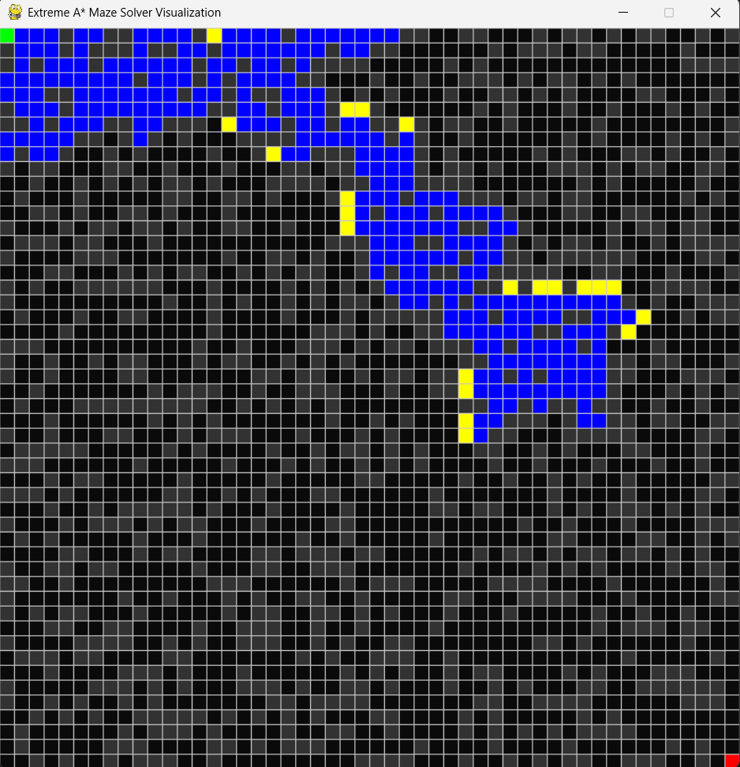
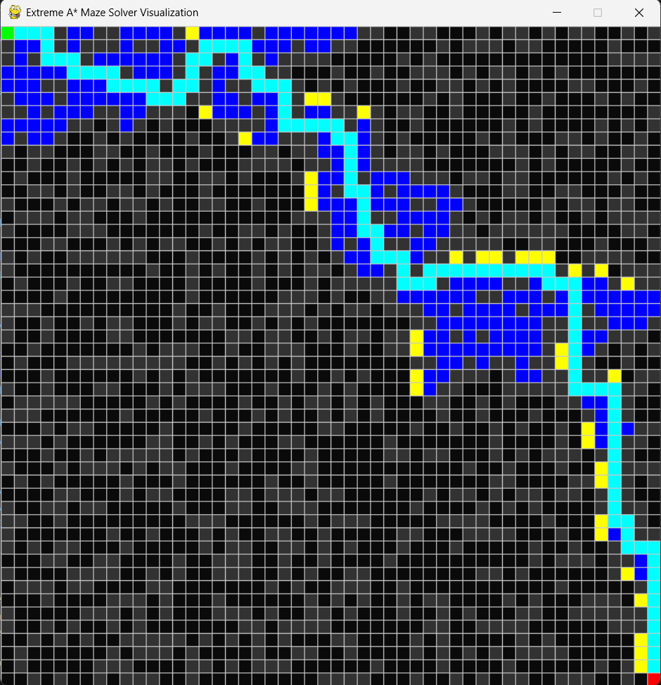

# Extreme A* Maze Solver & Visualizer

A high-performance pathfinding application that implements the **A* Search algorithm** to solve large, randomized grid-based mazes. This project features a real-time graphical visualization built with **Pygame** to demonstrate the mechanics of informed search frontiers.

## 🚀 Features
- **Optimal Pathfinding:** Uses the A* algorithm to guarantee the shortest path between start and goal points
- **Real-time Animation:** Visualizes the "Open Set" (nodes to explore) and "Closed Set" (nodes already visited) as the search progresses
- **Extreme Maze Generation:** Programmatically generates $N \times N$ mazes with configurable wall density for varying difficulty levels
- **Decoupled Architecture:** Modular code structure separating the search engine logic from the rendering window.

## 📸 Visualization
> **Note:** Images shown here, change everytime when the python command is run! Therefore, a new output is generated on each run.

| Search in Progress | Final Path Found |
| :--- | :--- |
|  |  |

## 🛠️ Tech Stack
- **Language:** Python 3.x
- **Libraries:** Pygame (Visualization), Heapq (Priority Queue), Math, Random.
